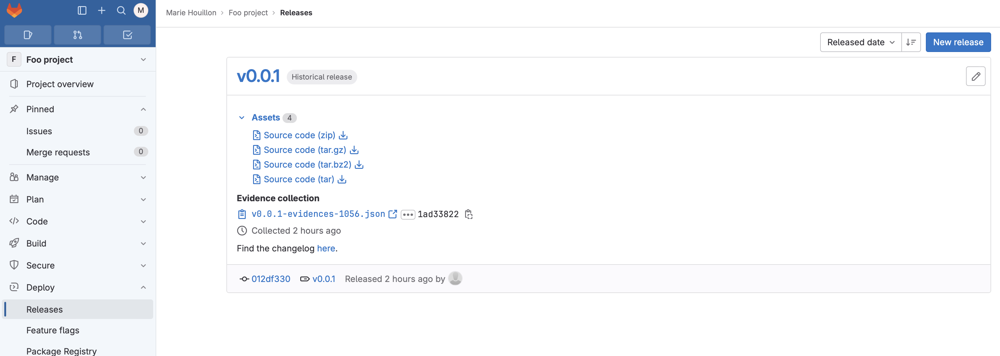

# Creation of a software release

In this tutorial, you will learn how to use openCARP-CI to create a software release on GitLab automatically (using Continuous Integration), in your own GitLab project.

## Prerequisites

In this tutorial, we will assume that you have already implemented the automatic CFF generation in your repository (see [the dedicated tutorial](01_automatic_cff_generation.md)).

## Set up the Continuous Integration (CI) configuration

### Protect the release tags

In order to prevent the release pipeline from being triggered from other branches than the main one, it is advised to make the Access Token `PUSH_TOKEN` that was created earlier _protected_. This means that this token can only be used in protected branches and tags.

As a consequence, we need to make the release tags that we will create _protected_, otherwise we won't be able to push to the repository from the CI pipeline triggered from this tag.

In order to do so, go to the Settings of your repository, then in Repository > Protected tags. Click on `Add tag` and protect the tags matching `pre-v*`. Then add a new tag and protect the tags matching `v*`.


### Modify `.gitlab-ci.yml`

If you have followed [the first tutorial](01_automatic_cff_generation.md), your repository should contain a file `.gitlab-ci.yml` which looks like this:
```
stages:
- build

variables:
  PROJECT_NAME: foo-project
  
  # Variables for metadata generation that will be used by the script `create_cff`
  CREATORS_LOCATIONS: codemeta.json
  CODEMETA_LOCATION: codemeta.json
  # Location where the CFF file will be generated
  CFF_PATH: CITATION.cff

include:
- local: .gitlab/ci/cff.gitlab-ci.yml
```

We will now add a stage `release` that will contain the release jobs, abd add some variables that will be used in this jobs.
We will also include the configuration file of the release jobs that we will create as `.gitlab/ci/release.gitlab-ci.yml`:
```
stages:
- build
- release

variables:
  PROJECT_NAME: foo-project
  
  # Variables for metadata generation
  CREATORS_LOCATIONS: codemeta.json
  CODEMETA_LOCATION: codemeta.json
  # Location where the CFF file will be generated
  CFF_PATH: CITATION.cff

  # Variables for releases
  RELEASE_TAG: ${CI_COMMIT_TAG}
  RELEASE_API_URL: ${CI_API_V4_URL}/projects/${CI_PROJECT_ID}/releases
  RELEASE_ARCHIVE_URL: ${CI_PROJECT_URL}/-/archive/${CI_COMMIT_TAG}/${PROJECT_NAME}-${CI_COMMIT_TAG}.tar.gz
  RELEASE_DESCRIPTION: |
    Find the changelog [here](${CI_PROJECT_URL}/blob/master/CHANGELOG.md).

include:
- local: .gitlab/ci/cff.gitlab-ci.yml
- local: .gitlab/ci/release.gitlab-ci.yml
```

### Create the file `gitlab/ci/release.gitlab-ci.yml`

Now we create the file `gitlab/ci/release.gitlab-ci.yml` containing the release jobs with the following content:
```
prepare-release:
  image: python:3.11
  stage: release
  rules:
  - if: $CI_COMMIT_TAG =~ /^pre/
  before_script:
  - pip install git+https://git.opencarp.org/openCARP/openCARP-CI.git
  - git config --global user.name "${GITLAB_USER_NAME}"
  - git config --global user.email "${GITLAB_USER_EMAIL}"
  script:
  - VERSION=`echo $CI_COMMIT_TAG | grep -oP '^pre-\K.*$'`
  - echo "Preparing release of $VERSION"
  - prepare_release --version=$VERSION
  - create_cff
  - git add ${CODEMETA_LOCATION} ${CFF_PATH}
  - git commit -m "Release ${VERSION}"
  - git push "https://PUSH_TOKEN:${PUSH_TOKEN}@${CI_REPOSITORY_URL#*@}" "HEAD:${CI_DEFAULT_BRANCH}"
  - git tag $VERSION
  - git push "https://PUSH_TOKEN:${PUSH_TOKEN}@${CI_REPOSITORY_URL#*@}" --tags

release-create:
  stage: release
  image: python:3.11
  rules:
  - if: $CI_COMMIT_TAG =~ /^v/
  before_script:
  - git config --global user.name "${GITLAB_USER_NAME}"
  - git config --global user.email "${GITLAB_USER_EMAIL}"
  - pip install git+https://git.opencarp.org/openCARP/openCARP-CI.git
  - export DEBIAN_FRONTEND="noninteractive"
  - apt update
  - apt-get install -y jq
  script:
  - create_release --release-description "$RELEASE_DESCRIPTION" --private-token "$PUSH_TOKEN"
``` 

## Create your first release

Now that the CI pipeline is configured, we can trigger the creation of a release.

* In the menu, go to Code > Tags.
* Click on New tag.
* As tag name, choose pre-v* where * is replaced by your software version identifier (`pre-v0.0.1` in our example).
* Click on Create tag.

.

The creation of this "pre-tag" will trigger the CI job `prepare-release` which will:
- update the metadata files for the release (version number, date of the release,...)
- Create a tag for the release (In our example, `v0.0.1`)


From the release tag, the CI job `release-create` will be triggered, and this job will create a GitLab release of your software.


